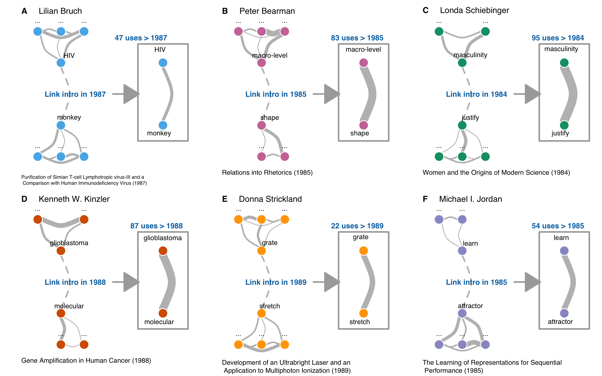

This repository contains code and data associated with “The
Diversity-Innovation Paradox in Science.” arXiv preprint and PDF can be
found [here](https://arxiv.org/abs/1909.02063).

Paper
-----

By analyzing data from nearly all US PhD-recipients and their
dissertations across three decades, this paper finds demographically
underrepresented students innovate at higher rates than majority
students, but their novel contributions are discounted and less likely
to earn them academic positions. The discounting of minorities’
innovations may partly explain their underrepresentation in influential
positions of academia.

 **Figure 1**. The introduction of innovations and
their subsequent uptake.

(A-F) Examples drawn from the data illustrate our measures of novelty
and impactful novelty. Nodes represent concepts and edge thickness
indicates the frequency of their co-usage. Students can introduce new
links (dotted lines) as their work enters the corpus. These examples
concern novel links taken up at significantly higher rates than usual
(e.g., 95 uses of Schiebinger’s link after 1984). The mean (median)
uptake of new links is .790 (333), and ~50% of new links never gets
taken up. (A) Lilian Bruch was among the pioneering HIV researchers (30)
and her thesis introduced the link between “HIV” and “monkeys”,
indicating innovation in scientific writing as HIV’s origins are often
attributed to non-human primates. (C) Londa Schiebinger was the first to
link “masculinity” with “justify,” reflecting her pioneering work on
gender bias in academia (31). (E) Donna Strickland won the 2018 Nobel
Prize in Physics for her PhD work on chirped pulse amplification,
utilizing grating-based stretchers and compressors (32).

 **Figure 2**. Gender and race representation
relate to novelty and impactful novelty.

1.  Introduction of novelty (\# new links) by the percentage of peers
    with a similar gender in a discipline (N = 808,375). Specifically,
    the results suggest that the more students’ own gender is
    underrepresented, the more novelty they introduce. (B) Similarly,
    the more students’ own race is underrepresented, the more novelty
    they introduce. (C) Binary gender and race indicators suggest that
    historically underrepresented groups in science (women, non-white
    scholars) introduce more novelty (i.e., their incidence rate is
    higher). (D) In contrast, impactful novelty decreases as students
    have fewer peers of a similar gender and suggests underrepresented
    genders have their novel contributions discounted (N = 345,257). (E)
    There is no clear relation between racial representation in a
    discipline and impactful novelty. (F) Yet, the novel contributions
    of women and non-white scholars are taken up less by others than
    those of men and white students (their incidence rate is lower).

 **Figure 3**. Underrepresented genders introduce
distal novelty, and distal novelty has less impact.

(A-B) Communities (colors) of concepts and their linkages. (A) The link
between “fracture\_behavior” and “ceramic\_composition” arises within a
semantic cluster. Both concepts are proximal in the embedding space of
scientific concepts, and as such, their distal novelty score is low. (B)
In contrast, the conceptual link between “genetic\_algorithm” and
“hiv-1” spans distinct clusters in the semantic network. As such, the
concepts are distal in the embedding space of scientific concepts, and
their distal novelty score is high. (C) Students of an overrepresented
gender introduce more proximal novelty, and students from an
underrepresented gender introduce more distal novelty in their theses.
(D) In turn, the average distance of new links introduced in a thesis is
negatively related to their future uptake.

 **Figure 4**. The novelty and impactful novelty
minorities introduce has discounted returns for their careers. (A-D)
Correlation of gender- and race-specific novelty with becoming research
faculty or continued researcher (N = 805,236). As novelty increases, the
probabilities of becoming faculty (for gender and race) and continuing
research (for race) has diminished returns for minorities. For instance,
a 2SD increase from the median level of novelty (\# new links) increases
the difference in probability to become research faculty between gender
minorities and majorities from 3.5% to 9.5%. (E-F) Correlation of
gender- and race-specific impactful novelty with becoming research
faculty and a continued researcher (when novelty is nonzero, N =
628,738). With increasing impactful novelty, the probabilities of
becoming faculty (for gender and race) and continuing research (for
gender) start to diverge at the expense of the career chances of
minorities. For instance, a 2SD increase from the median of impactful
novelty (uptake per new link) increases the difference in probability of
becoming research faculty between gender minorities and majorities from
4.3% to 15%.

Code
----

With the provided code provided the novelty, impactful novelty, and
distal novelty metrics can be constructed from the ProQuest dissertation
abstract data.

-   ***stms\_estimate\_at\_K.R***: Runs Structural Topic Models at
    specified range of K (50-1000 in the paper).
-   ***concepts\_k500\_50.R***: Extracts concepts from the structural
    topic model output, the number of words, topics, and FREX weighing
    can be adjusted in the code to get at the differend K/FREX
    scenarios.
-   ***novelty and impactful novelty***:
-   ***embeddings***:

Data
----

For the concepts extracted for the K = 500 Structural Topic Model where
we equally balance frequency and exclusivity (which we do in
**concepts\_k500\_50.R**), please see **k500\_wordcouds.zip** for
visualizations or **frexconcepts\_k500\_50.rda** for the data (second
element in the list).

For raw data of ProQuest or the Web of Science:

-   [ProQuest](https://www.proquest.com/)
-   [Web of Science](https://www.proquest.com/)

For inferring gender and race associated with names:

-   [US Census Data
    2000](https://census.gov/topics/population/genealogy/data/2000_surnames.html)
-   [US Census Data
    2010](https://census.gov/topics/population/genealogy/data/2010_surnames.html)
-   [Social Security Administration
    Data](https://www.ssa.gov/oact/babynames/limits.html)
    -   [*Hofstra et
        al. 2017*](https://journals.sagepub.com/doi/full/10.1177/0003122417705656):
        Method described here helps infer gender and race (with US
        Census and SSN).
-   [Florida Voter Registration
    Data](https://dataverse.harvard.edu/dataset.xhtml?persistentId=doi:10.7910/DVN/UBIG3F)
    -   [*ethnicolr*](https://github.com/appeler/ethnicolr) by [*Sood
        and Laohaprapanon*](https://arxiv.org/abs/1805.02109): Method
        used to further help infer race with the Florida Voter
        registration data.
-   [Genderize.io](https://genderize.io/) Method used to further help
    infer gender.
